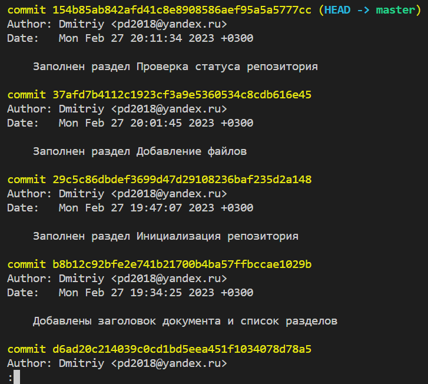
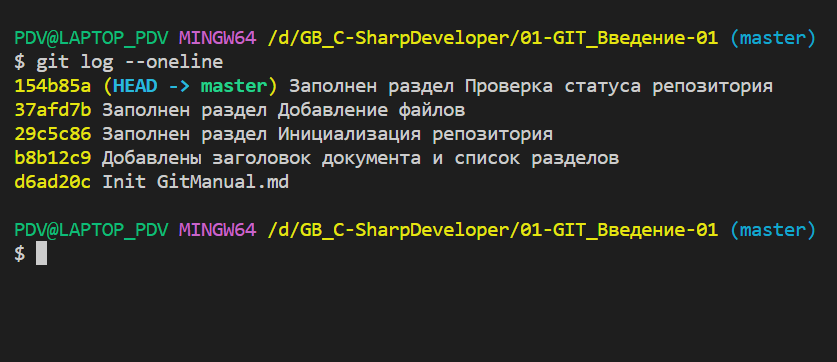
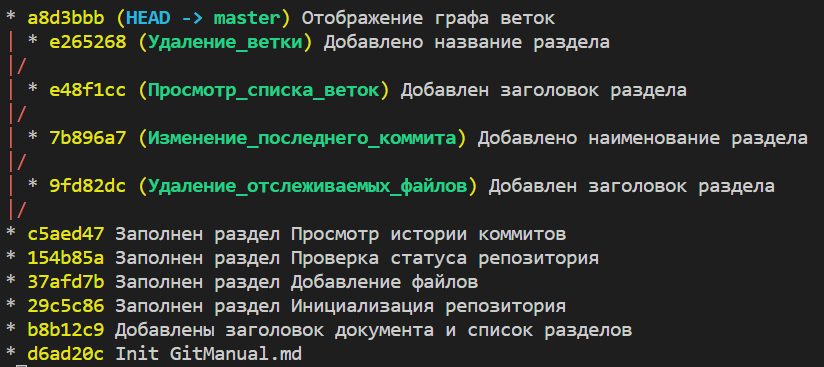

# Базовые команды Git

## Инициализация репозитория

Создать новый каталог. Перейти в это каталог и выполнить команду **_git init_**. (_В каталоге будет создана скрытая папка, в которой Git хранит историю работы над проектом._)

## Добавление файлов

1. Для добавления отдельного файла, необходимо ввести команду: **_git add fileName_**

1. Чтобы добавить все файлы, еобходимо ввести команду: **_git add ._**

## Проверка статуса репозитория

Согласно справочнику по Markdown,

> Просмотреть статус нужного репозитория можно по ключевому слову _status_.

Для этого, вводим команду **_git status_**

## Просмотр истории коммитов

Можно отобразить подробную и сокращённу историю коммитов.

1. Для отображения подробной истории, необходимо ввести команду: **_git log_**. Пример подробной истории коммитов:

Для отображения сокращённой истории, необходимо ввести команду: **_git log --oneline_**. Пример сокращённой истории коммитов:

## Отображение графа веток

Просмотреть историю коммитов в виде графа можно с помощью команды **_log_** и ключа **_graph_**. Например:

**_git log --graph_**.

Для получения лаконичного представления графа, можно добавить ключ **_oneline_**, а для вывода всех веток - ключ **_all_**. Например:

**_git log --all --graph --oneline_**

Пример вывода:

## Изменение последнего коммита

Внести изменения в сообщение последнего коммита можно параметром _**commit**_ с ключем **_amend_**. Например:

_**git commit --amend -m "Новый комментарий"**_

## Просмотр списка веток

Просмотреть историю коммитов в виде графа для текущей ветки можно с помощью параметра **_log_** и ключей _**graph**_ и _**oneline**_. А добавление ключа _**all**_ покажет все ветки. Например:

**_git log --all --graph --oneline_**

## Удаление ветки

Удалить ветку можно параметром _**branch**_ с добавлением ключа _**-d**_ и указанием имени ветки. Например:

_**git branch -d ИмяСуществующейВетки**_

## Удаление отслеживаемых файлов

Удалять файлы из текущего рабочего дерева можно с помощью параметра _**rm**_. Например:

_**git rm dirname/somefile.js**_
